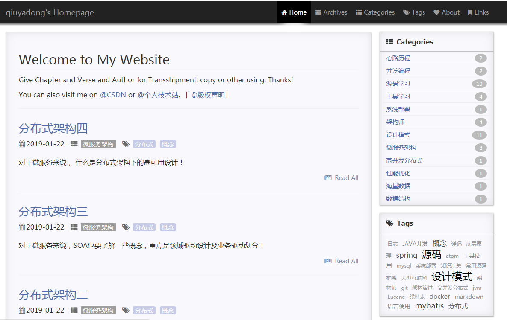

# Brian's Personal Website

---

## Introduction

This is my personal website based on jekyll.**Please give a star at this repository if you think it's nice.** Then you can clone it as your blog model.

这是我的个人网站，基于jekyll。**如果觉得不错，请先在这个仓库上点个star吧，这也是对我的肯定和鼓励，谢谢了。**

## Sample

## My modification

- create "_data" dir to store my personal infomation,not in the "_config.yml"
- the data in "Links" page also loaded from "_data" dir.
- modify the "Archive" page,make month displayed
- extract the comment part,reuse the "_include/comments.html" file

## Important Update
